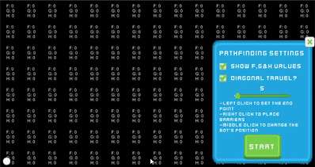

# A* Pathfinding Demo

In this showcase project, the A* Pathfinding algorithm was implemented visually within the Unity Engine. There is a grid representing the world, and the use can choose the start and end of the path with left click, and any obstacles in the way with right click, and the starting position of the bot with middle click. There is a customisable menu to the right to change parameters such as movement speed, whether the bot can move diagonally or whether the F, G and H values for the grid cells should be shown during the visualisation. 

